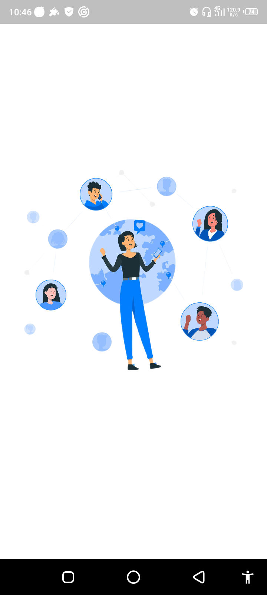
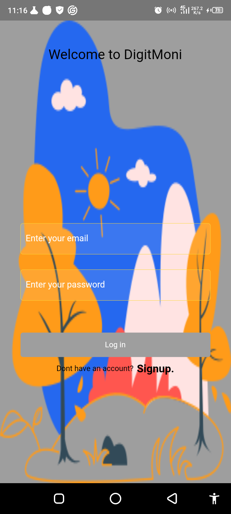
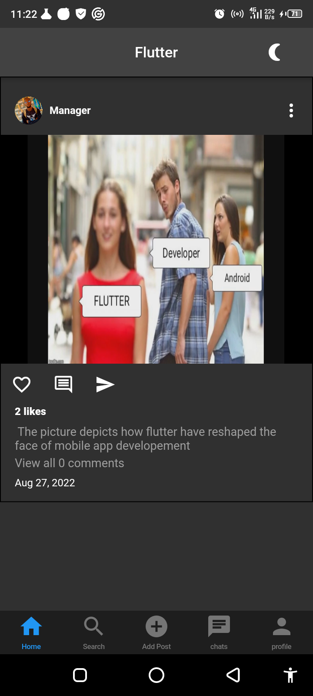
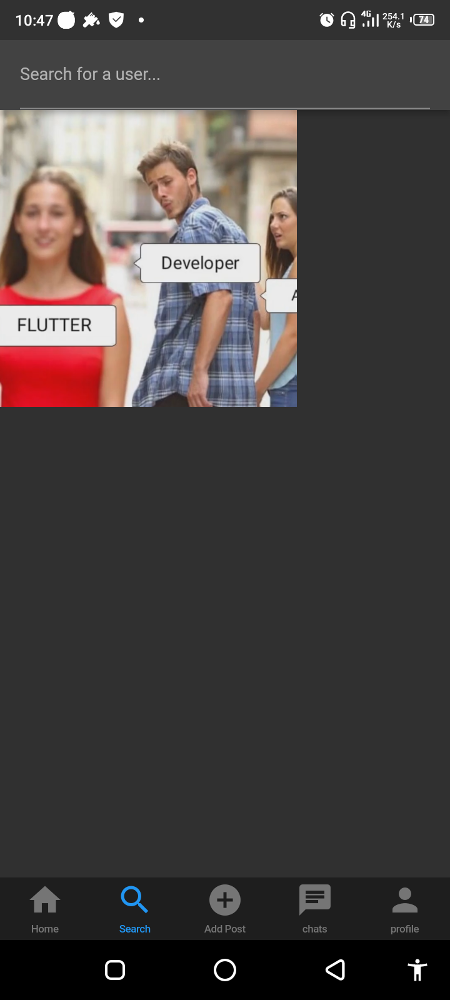
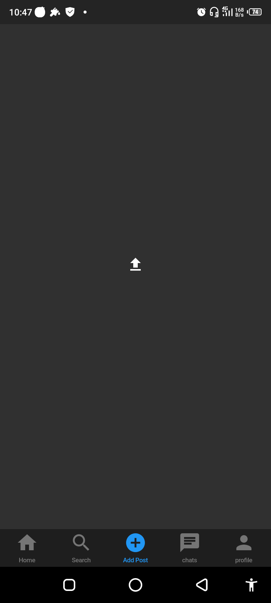
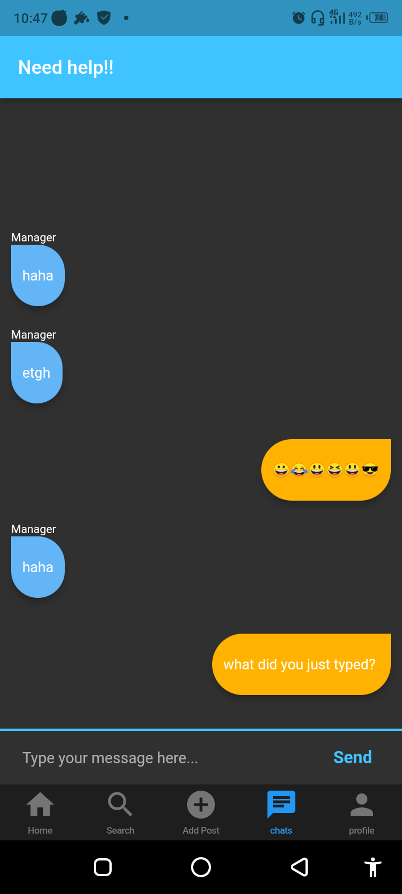
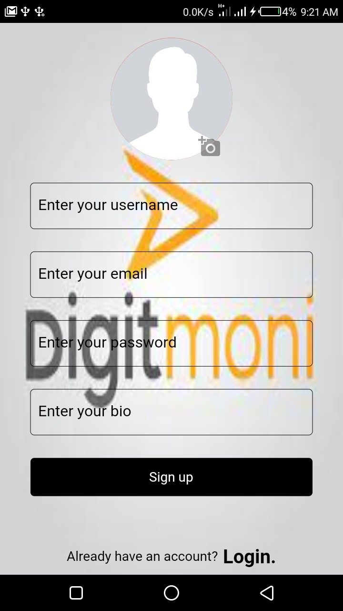
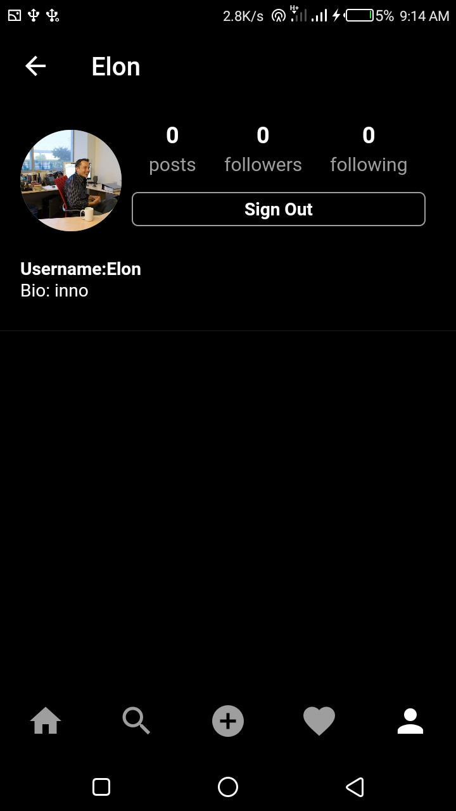

# digitmoni_project

A new Flutter project.

## Getting Started

This project is a starting point for a Flutter application in which the main purpose is to dive deep into the following;

1: User Experience using flutter(These includes: Designing beautiful user interface, )
2: State Management using Provider
3: Knowledge of Firebase(Authentication, Storage, FireStore)

- Screenshots of project samples
-                  
           
       
   
